这是地理创新实验的项目  
=======================
禁止抄袭``(不过反正你也抄不懂)``
------------------------------
### 概述
* 实验名称:一年之中(2021年)太阳在哪些时候会射入高一一班教室
* 实验班级:高二九班
* 日期:2021年4月4日
* 实验人员:孙文彬
* 详细内容请见本文件夹的其他项目文件或查看[GitHub相关项目](https://github.com/a15355447898a/Geography)
### 目录
* 实验目的
* 实验原理
* 实验器材
* 实验方法与步骤
* 实验结果与数据处理
* 实验结论
* 实验遇到的问题及改进
#### 实验目的
* 得出结论以方便同学们拉窗帘
#### 实验原理
* 计算机模拟
#### 实验器材
* 计算机,Mathematica
#### 实验方法与步骤
* 第一步：建立二体运动模型
* 第二步：带入地球数据
* 第三步：求近日点速度，时间，距离
* 第四步：算出太阳高度角计算公式
* 第五步：太阳高度角的数据计算与导出
* 第六步：太阳高度角的数据处理
* [这是第一部分的代码(如果无法看懂可以试着看一下同名PDF文件)](https://github.com/a15355447898a/Geography/tree/master/%E4%B9%8B%E5%89%8D%E7%A0%94%E7%A9%B6%E6%80%A7%E5%AD%A6%E4%B9%A0%E7%9A%84%E6%96%87%E4%BB%B6/%E4%BB%A3%E7%A0%81)
* [这是第二部分的代码(如果无法看懂可以试着看一下同名PDF文件)](https://github.com/a15355447898a/Geography/blob/master/%E5%A4%AA%E9%98%B3%E9%AB%98%E5%BA%A6%E8%A7%92%E8%AE%A1%E7%AE%97.nb)
* [这是第三部分的代码(如果无法看懂可以试着看一下同名PDF文件)](https://github.com/a15355447898a/Geography/blob/master/%E5%AE%9E%E9%AA%8C.nb)
##### 第一步：建立二体运动模型
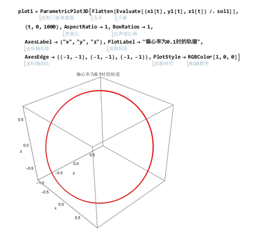 
 
##### 第二步：带入地球数据
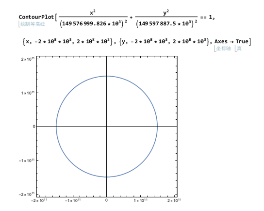 
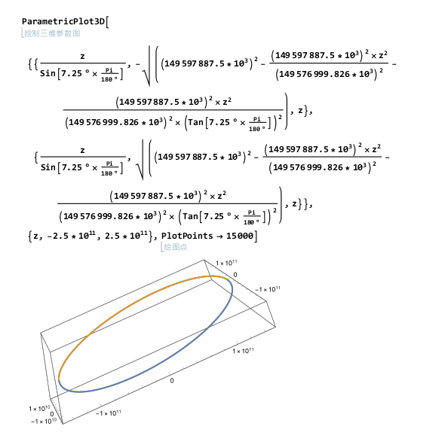 
##### 第三步：求近日点速度，时间，距离
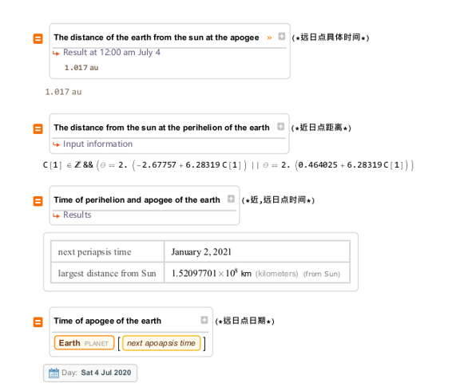 
##### 第四步：算出太阳高度角计算公式
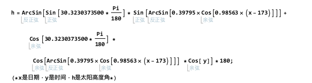 
##### 第五步：太阳高度角的数据计算与导出
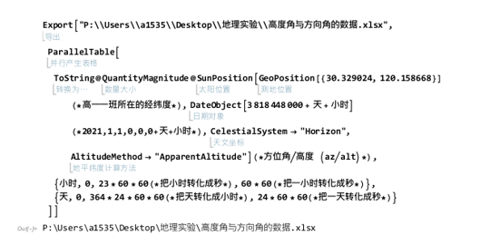 
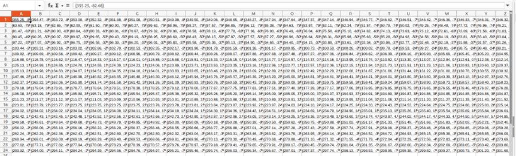 
##### 第六步：太阳高度角的数据处理
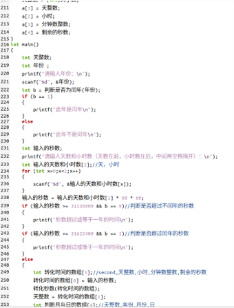 
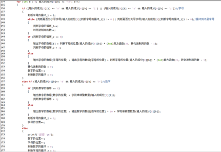 
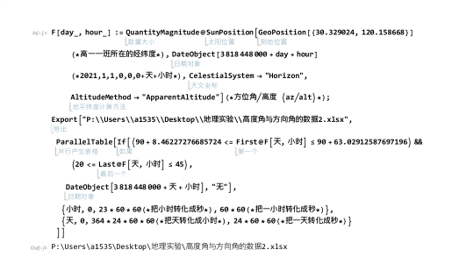 
#### 实验结果与数据处理
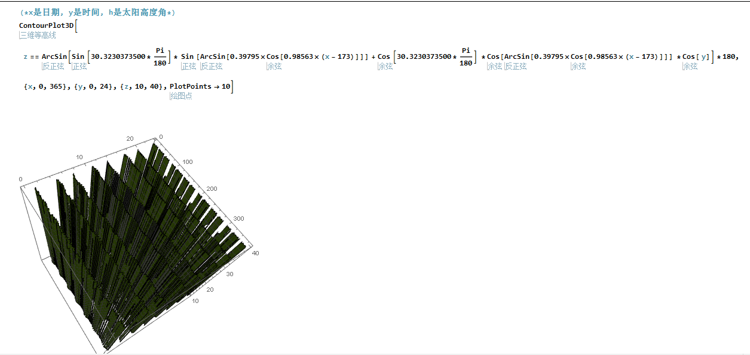 
#### 实验结论
 
#### 实验遇到的问题及改进
* 问题：电脑计算速度不够快
* 改进：减少数据密度，用C重写一遍
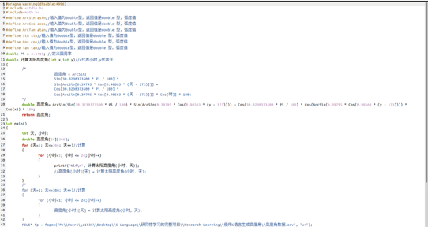